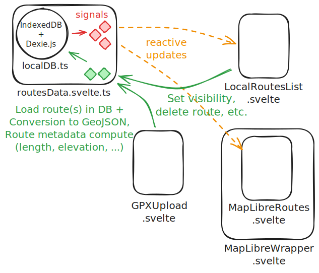

# Svelte-local-gpx-viewer

**PROJECT CURRENTLY UNDER HEAVY REFACTORING**

=> It's very likely that the project name and npm package name will change soon.
=> Project not stable yet, expect hiccups

## What is it?

- An editor app (local first, browser only) to load geo routes files, edit their metadata and export them for sharing and web publishing.
- A small collection of Svelte components and webcomponents (aka custom elements) to display the routes + metadata.

### Notable technical features

- Local-first database is powered by [Dexie.js](https://dexie.org/).
- Route and map display is powered by [maplibre](https://maplibre.org/) (and the [svelte-maplibre wrapper library](https://github.com/dimfeld/svelte-maplibre)).
- [Svelte (v5)](https://svelte.dev/) and [Sveltekit](https://svelte.dev/docs/kit/introduction) are used for the app and components (including the webcomponents)
- Wasm + webworkers responsive images processing for routes photos, powered by [jSquash](https://github.com/jamsinclair/jSquash)

---

## Outdated - will change

<picture>
  
  <figcaption>data flow, src https://excalidraw.com/#json=J76wNr3qpoTNb7qClGL-3,EOjQwX2D0gBL2e85Cp84fw</figcaption>
</picture>

## DB and data structures

## Using the components in a Svelte/Sveltekit project

See Documentation website: [https://0gust1.github.io/svelte-local-gpx-viewer/](https://0gust1.github.io/svelte-local-gpx-viewer/)

## Using the components in pure JS

TODO

## Developing

Once you've created a project and installed dependencies with `npm install` (or `pnpm install` or `yarn`), start a development server:

```bash
npm run dev

# or start the server and open the app in a new browser tab
npm run dev -- --open
```

Everything inside `src/lib` is part of your library, everything inside `src/routes` which id used for [the demo app](https://0gust1.github.io/svelte-local-gpx-viewer/).

## Building

To build and package the library (Svelte version):

```bash
npm run package
```

To create a production version of [the showcase app](https://0gust1.github.io/svelte-local-gpx-viewer/):

```bash
npm run build
```

You can them preview the showcase app build with `npm run preview`.

### Vanilla JS

To create a vanilla JS version of the library:

```bash
npm run build && npm run build:vanilla
```

This will create a `dist-js` folder with the compiled library.

- [] add an HTML file to the `dist-js` folder to test the integration of the library in a vanilla JS project.
- [] add a `README.md` file to the `dist-js` folder to explain how to use the library in a vanilla JS project.

refs:

- https://stackoverflow.com/questions/75832641/how-to-compile-svelte-3-components-into-iifes-that-can-be-used-in-vanilla-js/75895650#75895650
- https://svelte.dev/docs/svelte/imperative-component-api

## Publishing

To manually publish the library to [npm](https://www.npmjs.com):

```bash
npm publish
```

### Publishing through GitHub Actions

The workflow `.github/workflows/publish.yml` is set up to automatically publish the library to npm when a new release is created on GitHub.

This workflow will:

1. Detect pre-release status using github.event.release.prerelease
2. Determine the appropriate npm tag based on the release tag name
   - `alpha` for versions containing "alpha" (e.g., `v1.0.0-alpha.1`)
   - `beta` for versions containing "beta" (e.g., `v1.0.0-beta.1`)
   - `rc` for versions containing "rc" (e.g., `v1.0.0-rc.1`)
   - `next` for other pre-releases
   - `latest` for stable releases

#### Creating Pre-release Versions

When creating releases on GitHub:

1. For alpha versions: Tag as `v1.0.0-alpha.1` and check "Set as a pre-release"
2. For beta versions: Tag as `v1.0.0-beta.1` and check "Set as a pre-release"
3. For release candidates: Tag as `v1.0.0-rc.1` and check "Set as a pre-release"

#### Installing Pre-release Versions

```bash
# Install latest alpha
npm install your-package@alpha

# Install latest beta
npm install your-package@beta

# Install specific version
npm install your-package@1.0.0-alpha.1
```

## Dev notes

**hash router or classic router ?**

- Classical file routing promotes a better source code structure, but static-adapter doesn't like (understandably) dynamic routes (e.g. `edit-[id]`)
- One solution could be to use Sveltekit's hash router, but it is not working well with paraglide (i18n)
